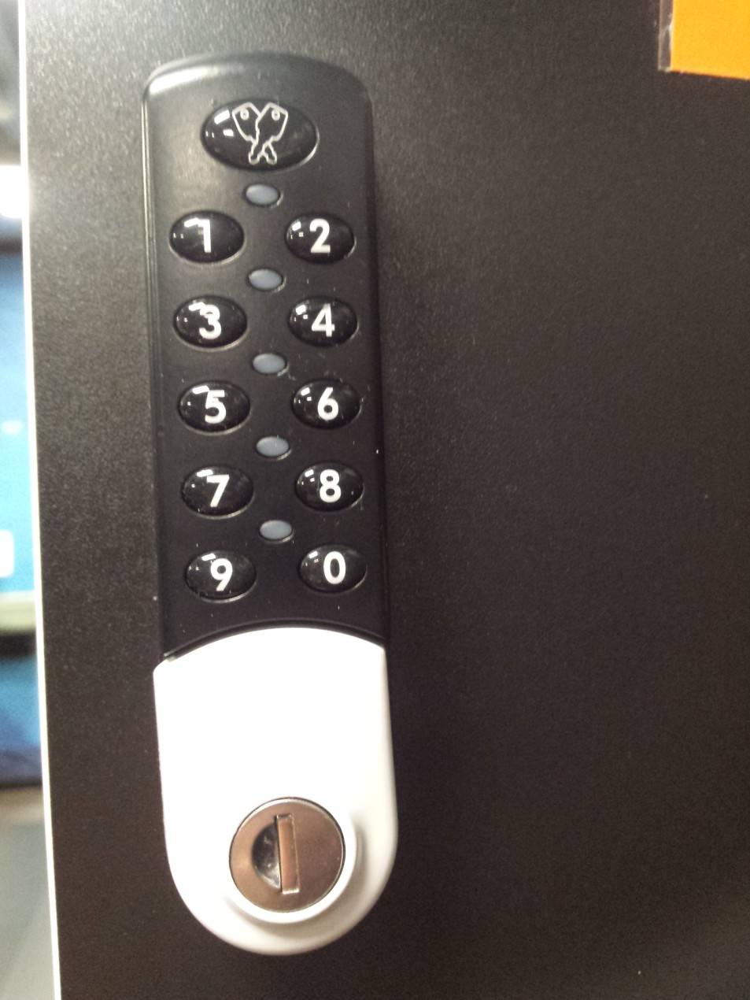

# Locker lock mechanism

## General Information
Inspired by locker lock in my gym.

There are full lock in the simulation: only ten numeric buttons and full locker lock mechanism.

## Screenshots

### Lock in the gym

### Lock

### Current state of the mechanism

## Technologies Used
- Java
- Swing
- Maven

## Features
- Simulation of the mechanism
- Ten numeric buttons
- Showing preview of the current state of the mechanism in the console

### Functions of Lock
- set code to locker lock
- locking up
- unlocking

## Usage
Run main method in Main class.